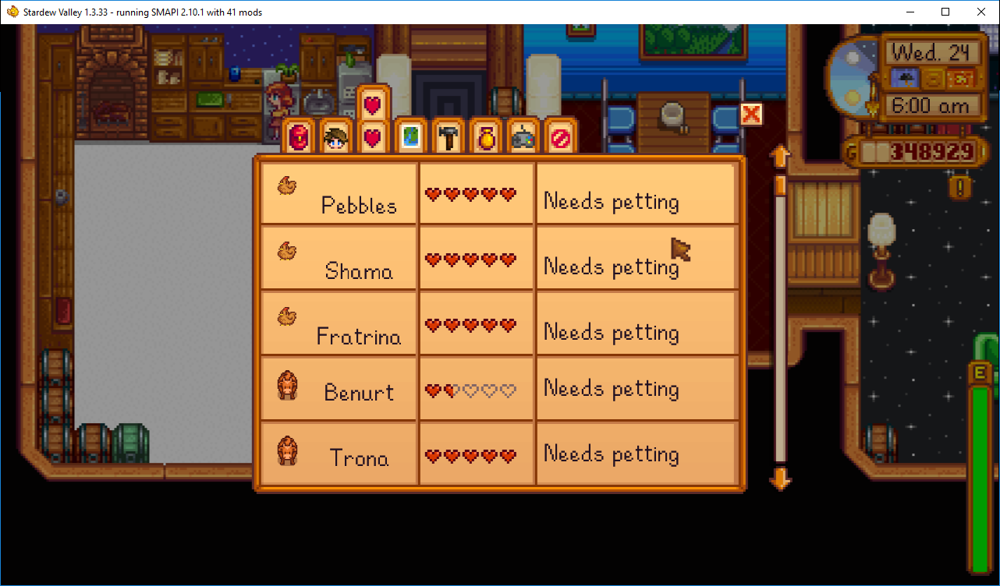

**Animal Social Menu** is a [Stardew Valley](http://stardewvalley.net/) mod which adds a social
menu for your animals. Check your animals' friendship values and if they need petting.

## Install
1. Install the latest version of...
   * [SMAPI](https://smapi.io);
   * and [SpaceCore](https://www.nexusmods.com/stardewvalley/mods/1348).
2. Install [this mod from Nexus Mods](http://www.nexusmods.com/stardewvalley/mods/3283).
3. Run the game using SMAPI.

## Use
Click the extra heart tab at the top of the in-game menu.

## Compatibility
Compatible with Stardew Valley 1.5.5+ on Linux/macOS/Windows, both single-player and multiplayer.

## See also
* [Release notes](release-notes.md)
