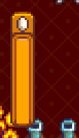

**Another Hunger Mod** is a [Stardew Valley](http://stardewvalley.net/) mod which adds a hunger
system to the game.

## Install
1. Install the latest version of...
   * [SMAPI](https://smapi.io);
   * and [SpaceCore](https://www.nexusmods.com/stardewvalley/mods/1348).
2. Install [this mod from Nexus Mods](http://www.nexusmods.com/stardewvalley/mods/3379).
3. Run the game using SMAPI.

## Use
* You have a fullness cap of 100, which reduces by 0.8 points every 10 minutes. Eating food
  restores fullness based on its edibility value, which is what the game uses to calculate stamina
  and health restored. (Essentially, the more stamina it restores, the more fullness it restores.)

  Your fullness provides buffs or debuffs:

  fullness | effects
  -------- | -------
  over 80  | improved speed and attack.
  below 25 | reduced speed.
  0        | starvation damage over time.

  Starving to death resets your fullness to 25.

* You need to feed your spouse each day. Forgetting to feed them will reduce friendship by 50 points
per day.

## Compatibility
Compatible with Stardew Valley 1.5.5+ on Linux/macOS/Windows, both single-player and multiplayer.

## See also
* [Release notes](release-notes.md)
