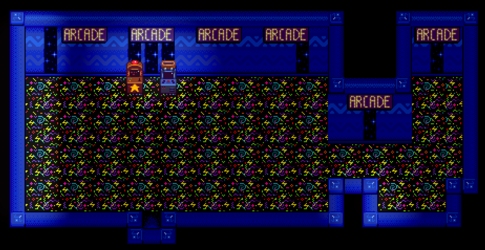
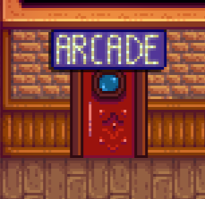

**Arcade Room** is a [Stardew Valley](http://stardewvalley.net/) mod which adds an arcade room in
the Saloon.

## Install
This mod isn't released yet.

1. ~~Install the latest version of...
   * ~~[SMAPI](https://smapi.io);~~
   * ~~and [SpaceCore](https://www.nexusmods.com/stardewvalley/mods/1348).~~
2. ~~Install this mod from Nexus Mods.~~
3. ~~Run the game using SMAPI.~~

## Use
Just walk to the Saloon and enter the new arcade door! The arcade currently includes Junimo Kart
and Prairie King.

## Compatibility
Compatible with Stardew Valley 1.5+ on Linux/macOS/Windows, both single-player and multiplayer.

## See also
* [Release notes](release-notes.md)
