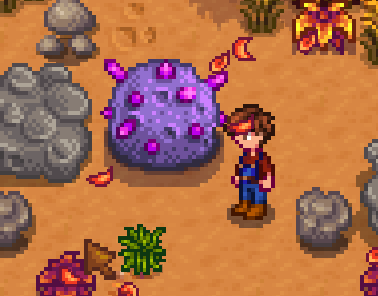

**Better Meteorites** is a [Stardew Valley](http://stardewvalley.net/) mod which improves loot
dropped by meteorites. They drop a lot of stone, coal, iridium ore, and geodes.

## Install
1. Install the latest version of [SMAPI](https://smapi.io).
2. Install [this mod from Nexus Mods](http://www.nexusmods.com/stardewvalley/mods/5096).
3. Run the game using SMAPI.

## Use
Just break meteorites and they'll drop many more items.

## Compatibility
Compatible with Stardew Valley 1.5.5+ on Linux/macOS/Windows, both single-player and multiplayer.

## See also
* [Release notes](release-notes.md)
