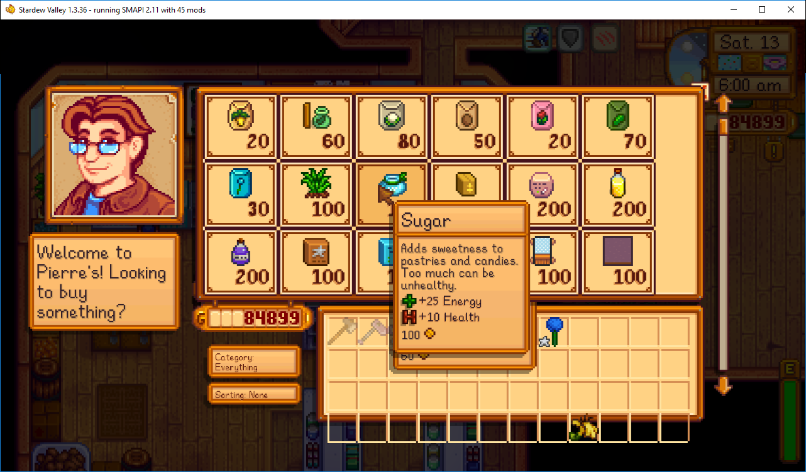

**Better Shop Menu** is a [Stardew Valley](http://stardewvalley.net/) mod which adds buttons to
filter shops by category and sort by price/name. You can also optionally change the shop menu into
a grid layout.

## Install
1. Install the latest version of [SMAPI](https://smapi.io).
2. Install [this mod from Nexus Mods](http://www.nexusmods.com/stardewvalley/mods/2012).
3. Run the game using SMAPI.

## Use
Just open any shop menu to see the new UI. Click the buttons in the bottom-left to sort/filter.

## Compatibility
Compatible with Stardew Valley 1.5.5+ on Linux/macOS/Windows, both single-player and multiplayer.

## See also
* [Release notes](release-notes.md)
