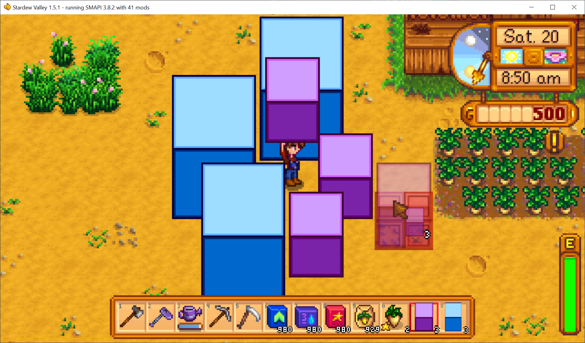

**Bigger Craftables** is a [Stardew Valley](http://stardewvalley.net/) mod which lets content packs
add big craftables bigger than one tile!

## Install
1. Install the latest version of [SMAPI](https://smapi.io).
2. Install [this mod from Nexus Mods](http://www.nexusmods.com/stardewvalley/mods/7530).
3. Run the game using SMAPI.

## Use
### For players
This mod does nothing on its own; you need to install content packs by unzipping them into your
`Mods` folder. See _Requirements_ > _Mods requiring this file_ on the Nexus mod page to find
content packs.

### For mod authors
See [example content pack](https://spacechase0.com/files/sdvmod/BiggerCraftables.Example.zip).

## Compatibility
Compatible with Stardew Valley 1.5.5+ on Linux/macOS/Windows, both single-player and multiplayer.

## See also
* [Release notes](release-notes.md)
