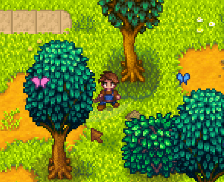

**Bug Net** is a [Stardew Valley](http://stardewvalley.net/) mod which lets you catch critters with
a net.



## Install
1. Install the latest version of...
   * [SMAPI](https://smapi.io);
   * and [SpaceCore](https://www.nexusmods.com/stardewvalley/mods/1348).
2. Install [this mod from Nexus Mods](http://www.nexusmods.com/stardewvalley/mods/5099).
3. Run the game using SMAPI.

## Use
Buy the bug net from Pierre's shop for 500g, hold it like any other tool, and swing it to catch
critters.

## Compatibility
Compatible with Stardew Valley 1.5.5+ on Linux/macOS/Windows, both single-player and multiplayer.

## For mod authors
You can register your custom critters in BugNet to make them catchable. To do so:

1. Copy [`IBugNetApi.cs`](../../SpaceShared/APIs/IBugNetApi.cs) into your mod code.
2. [Get the mod-provided API](https://stardewvalleywiki.com/Modding:Modder_Guide/APIs/Integrations#Mod-provided_APIs)
   for BugNet (mod ID: `spacechase0.BugNet`) using the `IBugNetApi` interface.
3. Register each custom critter with the `RegisterCritter` method.

For example:

```c#
private void OnGameLaunched(object sender, GameLaunchedEventArgs e)
{
    var api = this.Helper.ModRegistry.GetApi<IBugNetApi>("spacechase0.BugNet");
    if (api == null)
        return; // Bug Net isn't installed

    api.RegisterCritter(
        manifest: this.ModManifest,
        critterId: $"{this.ModManifest.UniqueID}/butterfly",
        texture: this.Helper.Content.Load<Texture2D>("assets/butterfly.png"),
        textureArea: new Rectangle(0, 0, 16, 16),
        defaultCritterName: "Golden Butterfly",
        translatedCritterNames: new Dictionary<string, string>
        {
            ["fr"] = "Papillon doré"
            // any other locales will use the default name
        },
        makeCritter: (int x, int y) => this.SpawnButterfly(x, y),
        isThisCritter: (Critter critter) => this.IsButterfly(critter)
    );
}
```

See IntelliSense on `IBugNetApi` for more info on each parameter.

## See also
* [Release notes](release-notes.md)
