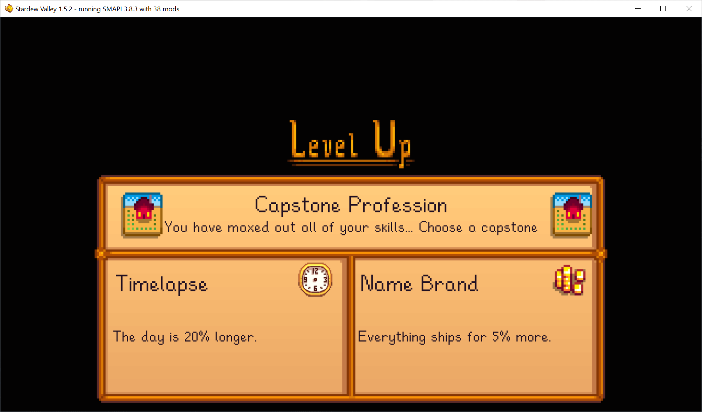

**Capstone Professions** is a [Stardew Valley](http://stardewvalley.net/) mod which adds a final
choice of professions once you max out all your skills.

## Install
1. Install the latest version of...
   * [SMAPI](https://smapi.io);
   * and [SpaceCore](https://www.nexusmods.com/stardewvalley/mods/1348).
2. Install [this mod from Nexus Mods](http://www.nexusmods.com/stardewvalley/mods/7636).
3. Run the game using SMAPI.

## Use
Once you've maxed out all your skill levels, a new profession choice arrives overnight... Both
professions stack with multiple players.

## Compatibility
Compatible with Stardew Valley 1.5.5+ on Linux/macOS/Windows, both single-player and multiplayer.

Compatible with [All Professions](https://www.nexusmods.com/stardewvalley/mods/174).

## See also
* [Release notes](release-notes.md)
