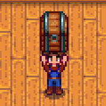

**Carry Chest** is a [Stardew Valley](http://stardewvalley.net/) mod which lets you move chests
around, even if they have things in them.

## Install
1. Install the latest version of [SMAPI](https://smapi.io).
2. Install [this mod from Nexus Mods](http://www.nexusmods.com/stardewvalley/mods/1333).
3. Run the game using SMAPI.

## Use
Just pick up a chest like normal, even if it's not empty!

**Caution:** placing a non-empty chest without the mod installed will lose its contents.

## Compatibility
Compatible with Stardew Valley 1.5+ on Linux/macOS/Windows, both single-player and multiplayer.

## See also
* [Release notes](release-notes.md)
