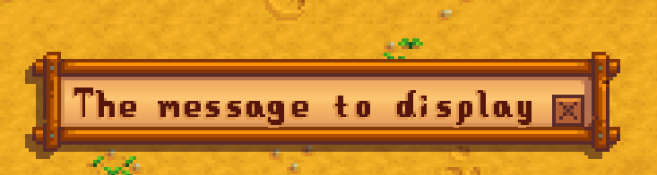
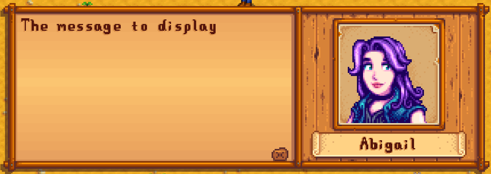
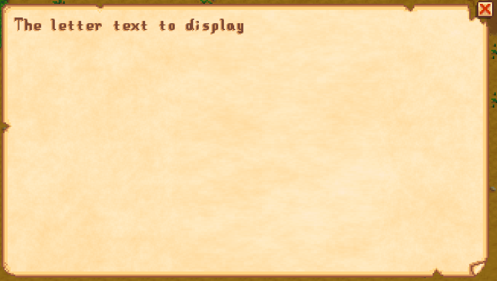
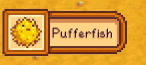

[← back to readme](README.md)

This document helps mod authors create a content pack using C# snippets.

**See [main README](README.md) for other info.**

## Contents
* [Getting started](#getting-started)
  * [Intro](#intro)
  * [Use code in a content pack](#use-code-in-a-content-pack)
* [Format](#format)
  * [Overview](#overview)
  * [Utilities](#utilities)
  * [Content Patcher tokens](#content-patcher-tokens)
* [Code events](#code-events)
  * [Save loaded](#save-loaded)
  * [Map action](#map-action)
* [Example snippets](#example-snippets)
* [See also](#see-also)

## Getting started
### Intro
Content Code lets you [write a normal Content Patcher pack](https://stardewvalleywiki.com/Modding:Content_Patcher),
and run C# code blocks in response to certain in-game actions and events.

For example, here's a complete content pack which adds a message in [Dwarvish](https://stardewvalleywiki.com/Dwarvish_Translation_Guide)
at the bus stop:

```js
{
    "Format": "1.24.0",
    "Changes": [
        // add action to map
        {
            "Action": "EditMap",
            "Target": "Maps/BusStop",
            "MapTiles": [
                {
                    "Position": { "X": 14, "Y": 15 },
                    "Layer": "Buildings",
                    "SetProperties": {
                        "Action": "Example.YourModId/SayDwarvish Dark secrets lie herein."
                    }
                }
            ]
        },

        // handle custom action
        {
            "Action": "EditData",
            "Target": "spacechase0.ContentCode/Action",
            "Entries": {
                "Example.YourModId/SayDwarvish": "
                    Game1.drawObjectDialogue(Dialogue.convertToDwarvish(actionString));
                "
            }
        }
    ]
}
```

### Use code in a content pack
1. [Create a content pack for Content Patcher](https://stardewvalleywiki.com/Modding:Content_Patcher)
   (if you haven't already).
2. Add Content Code as a dependency in your content pack's `manifest.json` file:
   ```js
    "Dependencies": [
        {
            "UniqueID": "spacechase0.ContentCode"
        }
    ],
    ```
3. Add code by patching Content Code's data assets using `EditData`. See the following sections for
   more info.

## Format
### Overview
Although there are several [code events](#code-events) available, they all use the same format: an
entry whose string value is the C# code to run. You can use C# strings by escaping the quotes (like
`\"`) or by using <code>`</code> instead.

This can be a single line:
```js
{
    "Action": "EditData",
    "Target": "spacechase0.ContentCode/Action",
    "Entries": {
        "Example.YourModId/Say": "Game1.drawObjectDialogue(actionString);"
    }
}
```

Or it can be a multiline script:
```js
{
    "Action": "EditData",
    "Target": "spacechase0.ContentCode/Action",
    "Entries": {
        "Example.YourModId/AddNumbers": "
            int answer = 0;

            string[] args = actionString.Split(' ');
            foreach (string arg in args)
                answer += Convert.ToInt32(arg);

            Game1.drawObjectDialogue($`The answer is {answer}`);
        "
    }
}
```

### Utilities
Within the code block, you have access to all of the game's static state like `Game1.player` or
`Game1.currentLocation`. Documenting the game state is beyond the scope of this guide, but you can
can check the [example snippets](#example-snippets) below, [decompile the game
code](https://stardewvalleywiki.com/Modding:Modder_Guide/Get_Started#How_do_I_decompile_the_game_code.3F),
or come ask in [`#making-mods` on the Stardew Valley Discord](https://stardewvalleywiki.com/Modding:Community#Discord).

You also have access to some utility variables injected by Content Code:

variable | type | purpose
-------- | ---- | -------
`ContentPack` | [`IContentPack`](https://github.com/Pathoschild/SMAPI/blob/develop/src/SMAPI/IContentPack.cs) | Access SMAPI's [content pack APIs](https://stardewvalleywiki.com/Modding:Modder_Guide/APIs/Content_Packs) for your content pack. For example, this can be used to read/write files your content pack.
`Reflection` | [`IReflectionHelper`](https://github.com/Pathoschild/SMAPI/blob/develop/src/SMAPI/IReflectionHelper.cs)  | Use [SMAPI's reflection API](https://stardewvalleywiki.com/Modding:Modder_Guide/APIs/Reflection) to access private game code.
`State` | `Dictionary<string, object>` | A field where you can store data shared between your code snippets. This is persisted for the duration of the current game session.

### Content Patcher tokens
You can use Content Patcher tokens directly in your code. The tokens are replaced by their value
_before_ the C# script is compiled. In other words, you can pass token values into C# like this:

```js
{
    "Action": "EditData",
    "Target": "spacechase0.ContentCode/Action",
    "Entries": {
        "Example.YourModId/SayHello": "Game1.drawObjectDialogue(`{{i18n: hello-translation }}`);"
    }
}
```

However you can't pass a C# value into the token:

```js
// ❌ won't work!
{
    "Action": "EditData",
    "Target": "spacechase0.ContentCode/Action",
    "Entries": {
        "Example.YourModId/SayHello": "Game1.drawObjectDialogue(`{{i18n: ` + actionString + ` }}`);"
    }
}
```

## Code events
### Save loaded
Edit `spacechase0.ContentCode/SaveLoaded` to run code when the player loads the save or joins a
multiplayer world (see [SMAPI's `SaveLoaded`
event](https://stardewvalleywiki.com/Modding:Modder_Guide/APIs/Events#GameLoop.SaveLoaded) for more
info).

The key should be your mod ID.

For example:

```js
{
    "Format": "1.24.0",
    "Changes": [
        {
            "Action": "EditData",
            "Target": "spacechase0.ContentCode/SaveLoaded",
            "Entries": {
                "Example.YourModID": "
                    // store the time when the save was loaded for future use
                    State.Add(`timeStartedPlaying`, DateTime.Now);

                    // show a dialogue box
                    Game1.drawObjectDialogue($`Welcome to {Game1.MasterPlayer.farmName}!`);
                "
            }
        }
    ]
}
```

### Map action
Edit `spacechase0.ContentCode/Action` or `spacechase0.ContentCode/TouchAction` to add a custom
`Action` or `TouchAction` [map property](https://stardewvalleywiki.com/Modding:Maps) which you can
use in your maps. These are equivalent, except that `Action` is triggered when the player clicks on
the tile and `TouchAction` is triggered when they step on it.

The key should be your mod ID and an action name, separated with a slash.

If your action has any arguments, you can read them using the `actionString` variable. You can also
split it like `string[] args = actionString.Split(' ')` and read individual arguments like `args[0]`.

For example:

```js
{
    "Format": "1.24.0",
    "Changes": [
        {
            "Action": "EditData",
            "Target": "spacechase0.ContentCode/Action",
            "Entries": {
                "Example.YourModID/TestAction": "
                    var cursor = Game1.currentCursorTile;
                    var tile = Game1.player.getTileLocation();

                    Game1.drawObjectDialogue(`Your cursor is at {cursor.X}, {cursor.Y}!`);
                    Game1.drawObjectDialogue($`You're standing on {tile.X}, {tile.Y}!`);
                "
            }
        }
    ]
}
```

When adding the action to a map, use the entire key (including your mod ID) like in the [intro
example](#intro).

## Example snippets
See also _[common tasks](https://stardewvalleywiki.com/Modding:Common_tasks)_ on the wiki.

### Show a dialogue box
See [dialogue modding](https://stardewvalleywiki.com/Modding:Dialogue) on the wiki.

<table>
<tr>
<th>code</th>
<th>result</th>
</tr>

<tr>
<td>

```c#
Game1.drawObjectDialogue(`The message to display`);
```

</td>
<td></td>
</tr>

<tr>
<td>

```c#
var abigail = Game1.getCharacterFromName(`Abigail`);
Game1.drawDialogue(abigail, `The message to display`);
```

</td>
<td></td>
</tr>
</table>

### Show a custom letter
See [mail modding](https://stardewvalleywiki.com/Modding:Mail_data) on the wiki.

<table>
<tr>
<th>code</th>
<th>result</th>
</tr>

<tr>
<td>

```c#
Game1.drawLetterMessage(`The letter text to display`);
```

</td>
<td></td>
</tr>
</table>


### Give player an item
See [object data](https://stardewvalleywiki.com/Modding:Object_data) on the wiki for item IDs.

<table>
<tr>
<th>code</th>
<th>result</th>
</tr>

<tr>
<td>

```c#
var item = new StardewValley.Object(128, 1);
Game1.player.addItemByMenuIfNecessary(item);
```

</td>
<td></td>
</tr>
</table>

### Set a [mail flag](https://stardewvalleywiki.com/Modding:Mail_data#Mail_flags)
```c#
Game1.player.mailReceived.Add(`YourModID_ExampleMailFlag`);
```

### Add a locked action
You can run custom code in a [map action](#map-action) which performs an action (e.g. warping the
player) if they meet the criteria, else shows a message box.

For example, this warps the player to [Ginger Island](https://stardewvalleywiki.com/Ginger_Island)
if they've built the island house, and otherwise shows a mysterious message.

```c#
if (Game1.player.hasOrWillReceiveMail(`Island_UpgradeHouse`))
{
    Game1.warpFarmer(locationName: `IslandEast`, tileX: 30, tileY: 10, facingDirectionAfterWarp: Farmer.down);
}
else
{
    Game1.drawObjectDialogue(`I wonder what this statue does...?`);
}
```


## See also
* [README](README.md) for other info
* [Intro to Content Patcher](https://stardewvalleywiki.com/Modding:Content_Patcher)
