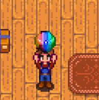

**Content Patcher Animations** is a [Stardew Valley](http://stardewvalley.net/) mod which lets you
animate textures in Content Patcher with its `EditImage` action.

## Install
1. Install the latest version of...
   * [SMAPI](https://smapi.io);
   * and [Content Patcher](https://www.nexusmods.com/stardewvalley/mods/1915).
2. Install [this mod from Nexus Mods](http://www.nexusmods.com/stardewvalley/mods/3853).
3. Run the game using SMAPI.

## Use
### For players
Just install the mod and it'll work automatically for content packs that use it.

### For mod authors
1. Create a content pack for [Content Patcher](https://www.nexusmods.com/stardewvalley/mods/1915).
2. Add an `EditImage` patch for the image you want to animate.
3. Give the patch a unique `LogName` value.
4. Add these two fields to your patch:
   * `AnimationFrameTime` is the number of ticks between each frame (in game ticks, which is 1/60th
     of a second);
   * `AnimationFrameCount` is the number of frames.

All frames must be next to each other horizontally in the same `FromFile` image.

See [an example content pack](https://spacechase0.com/files/sdvmod/ContentPatcherAnimationTest.zip).

### Console commands
Content Patcher Animations adds two commands to the SMAPI console window:

command      | effect
------------ | ------
`cpa reload` | Immediately reload all animation data from installed Content Patcher packs. Mainly useful to quickly test when editing content packs.
`cpa summary` | Print a summary of current animation data.

## Compatibility
Compatible with Stardew Valley 1.5+ on Linux/macOS/Windows, both single-player and multiplayer.

## See also
* [Release notes](release-notes.md)
