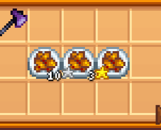

**Cooking Skill** is a [Stardew Valley](http://stardewvalley.net/) mod which adds a new cooking
skill to the game.

## Install
1. Install the latest version of...
   * [SMAPI](https://smapi.io);
   * and [SpaceCore](https://www.nexusmods.com/stardewvalley/mods/1348).
2. Install [this mod from Nexus Mods](http://www.nexusmods.com/stardewvalley/mods/522).
3. Run the game using SMAPI.

## Use
Just like the vanilla skills, the cooking skill appears on the player tab of the game menu, and you
can level it up and choose professions. You get cooking experience by cooking, and better food
gives more experience.

Food cooked in the kitchen recovers more energy/health the higher level you are. The mod also adds
a chance of silver- and gold-quality food, which increases with your cooking skill level.

Available professions:

* Level 5: Gourmet (+20% sell price).
  * Level 10: Efficient (15% chance to not consume ingredients).
  * Level 10: Professional Chef (Home-cooked meals are always at least silver).
* Level 5: Satisfying (+25% buff duration once eaten).
  * Level 10: Intense Flavors (Food buffs are one level stronger once eaten).
  * Level 10: Secret Spices (Provides a few random buffs when eating unbuffed food).

## Compatibility
Compatible with Stardew Valley 1.5.5+ on Linux/macOS/Windows, both single-player and multiplayer.

Compatible with [Experience Bars](https://www.nexusmods.com/stardewvalley/mods/509) and [All
Professions](https://www.nexusmods.com/stardewvalley/mods/174).

## See also
* [Release notes](release-notes.md)
