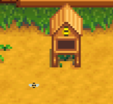

**Custom Critters** is a [Stardew Valley](http://stardewvalley.net/) mod which lets content packs
add custom critters to the world.

## Install
1. Install the latest version of [SMAPI](https://smapi.io).
2. Install [this mod from Nexus Mods](http://www.nexusmods.com/stardewvalley/mods/1255).
3. Run the game using SMAPI.

## Use
* **For players:** just install the mod and it'll work automatically for content packs that use it.
* **For mod authors:** see [example content pack](https://www.nexusmods.com/stardewvalley/mods/1259).

## Compatibility
Compatible with Stardew Valley 1.5.5+ on Linux/macOS/Windows, both single-player and multiplayer.

## See also
* [Release notes](release-notes.md)
