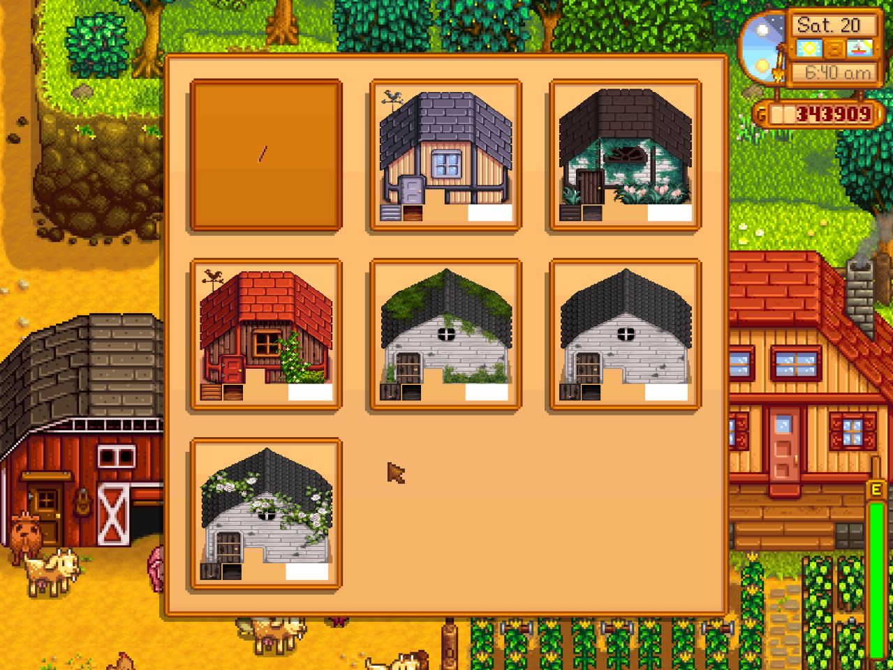
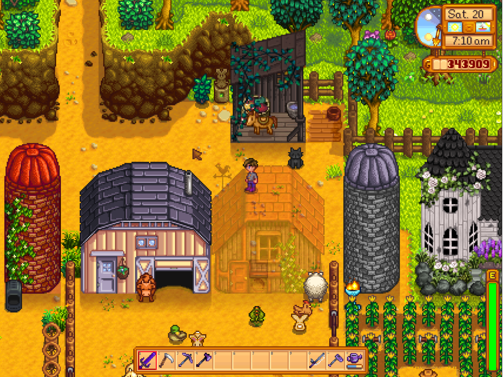

# Customize Exterior
This is the source code. Releases can be found at:
* [My site](http://spacechase0.com/mods/stardew-valley/customize-exterior/)
* [Nexus](http://www.nexusmods.com/stardewvalley/mods/1099/)
* [Chucklefish forums](http://community.playstarbound.com/threads/customize-exterior.132253/)

This mod lets you customize the exterior of your buildings individually.

This mod is compatible with Map Image Exporter. It also supports textures made for Seasonal
Immersion, even without Seasonal Immersion installed.

To select a texture for a building, double right-click it. (You must click the portion where it is
solid.)

This mod comes with no extra building textures on its own. For information on adding textures, look
below.

  



## Examples in screenshot
For the texture sets shown in the screenshot, see:
* [Birch Building Mods](http://www.nexusmods.com/stardewvalley/mods/583)
* [Medieval modern buildings](http://www.nexusmods.com/stardewvalley/mods/419)
* [Seasonal Vanilla](http://www.nexusmods.com/stardewvalley/mods/928)
* [Victorian era Buildings](http://www.nexusmods.com/stardewvalley/mods/682)
* [Seasonal Victorian Buildings](http://www.nexusmods.com/stardewvalley/mods/891)

## Adding texture choices
Download a bundle that you would normally put in your content folder, and instead place it in the
'Buildings' folder in the CustomizeExterior mod folder.

This would result with:
```
Mods/CustomizeExterior
+ manifest.json
+ CustomizeExterior.dll
+ CustomizeExterior.pdb
+-+ Buildings
  +-+ TextureSetA
  | + Shed.xnb
  | + houses.xnb
  | + ...
  |
  +-+ TextureSetB
  | + Shed.xnb
  | + houses.xnb
  | + ...
  |
  +-+ TextureSetC_SeasonalImmersion
    +-+ spring
    | + Shed.xnb
    | + houses.xnb
    | + ...
    |
    +-+ summer
    | + Shed.xnb
    | + houses.xnb
    | + ...
    |
    +-+ fall
    | + Shed.xnb
    | + houses.xnb
    | + ...
    |
    +-+ winter
    | + Shed.xnb
    | + houses.xnb
    | + ...
```

## See also
* [Release notes](release-notes.md)
