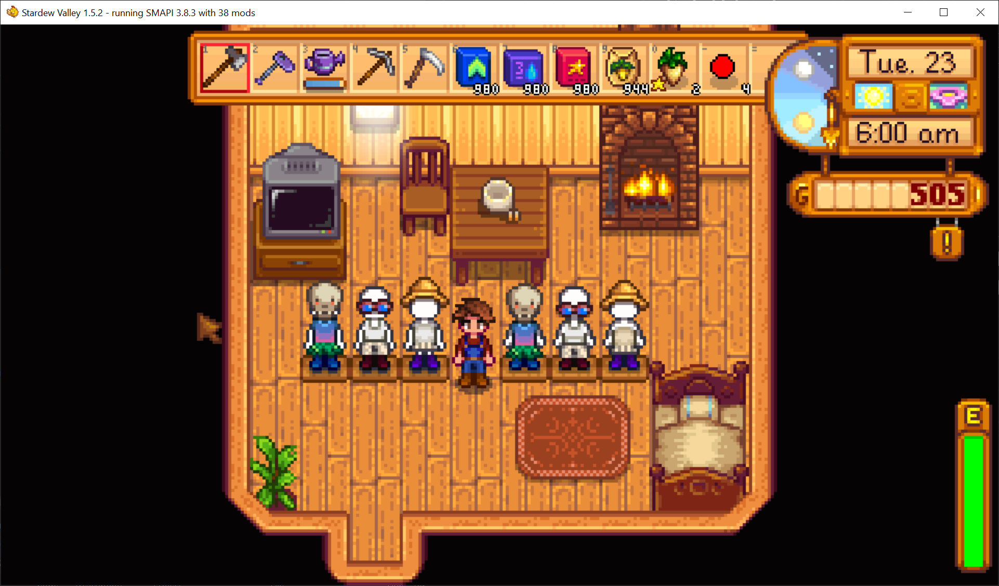

**Displays** is a [Stardew Valley](http://stardewvalley.net/) mod which adds mannequins you can use
to display your clothes.



## Install
1. Install the latest version of...
   * [SMAPI](https://smapi.io);
   * [SpaceCore](https://www.nexusmods.com/stardewvalley/mods/1348).
2. Install [this mod from Nexus Mods](http://www.nexusmods.com/stardewvalley/mods/7635).
3. Run the game using SMAPI.

## Use
Purchase mannequins from Robin. Right-click with the item you want to put on it, or with an empty
hand to swap what you currently have equipped.

## Compatibility
Compatible with Stardew Valley 1.5.5+ on Linux/macOS/Windows, both single-player and multiplayer.

## FAQs
### Why are dyed shirt colors sometimes not shown?
That's a game limitation for dyed shirts on a different-gendered display (e.g. on a womannequin if
your character is male). The dye is still present and will be visible when you swap it back onto
your character.

You can avoid that by placing dyed shirts on a display of the same gender as your character.

### Why don't displays appear in CJB Item Spawner?
They're special items which don't exist in the game data, so there's no way for CJB Item Spawner to
find them.

As a workaround, you can spawn them like this:

1. Type this command directly into the SMAPI console:
   ```
   player_adddisplay mannequin female 100
   ```
2. Change `female` to `male` if needed, and `100` to the desired number of mannequins.
3. Press enter to send the command.

## See also
* [Release notes](release-notes.md)
