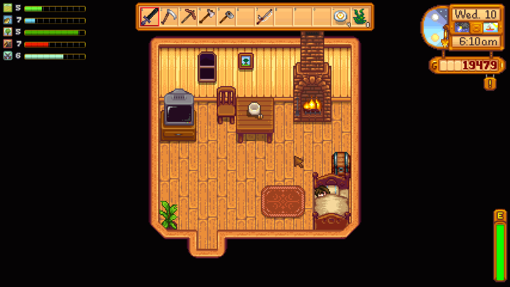
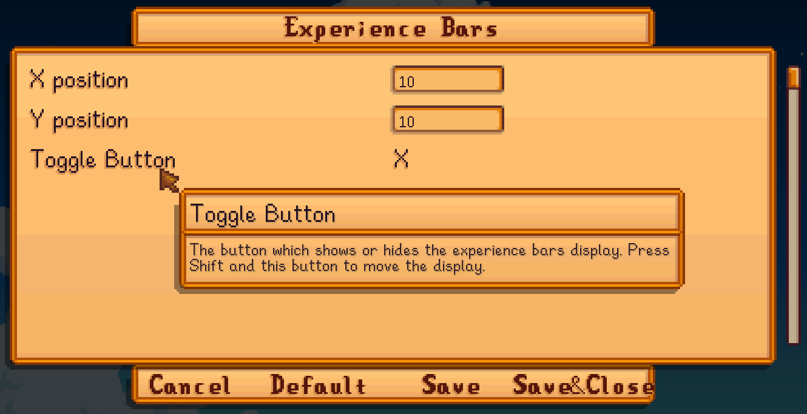
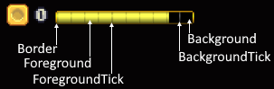

**Experience Bars** is a [Stardew Valley](http://stardewvalley.net/) mod which adds experience bars
for your skill levels, so you can see how far you are from leveling.

## Install
1. Install the latest version of [SMAPI](https://smapi.io).
2. Install [this mod from Nexus Mods](http://www.nexusmods.com/stardewvalley/mods/509).
3. Run the game using SMAPI.

## Use
Press `X` to toggle the display. Move the display with `Shift` + `X`.

## Configure
### In-game settings
If you have [Generic Mod Config Menu](https://www.nexusmods.com/stardewvalley/mods/5098) installed,
you can click the cog button (⚙) on the title screen to configure the mod. Hover the cursor over a
field for details, or see the next section.

Note that the colors aren't editable through this UI.

### `config.json` file
The mod creates a `config.json` file in its mod folder the first time you run it. You can open that
file in a text editor to configure the mod. If you make a mistake, you can delete the `config.json`
and it'll recreate a default one.

Here's what you can change:

field | description
----- | -----------
`ToggleBars` | The button which shows or hides the experience bars display.
`Position` | The x and Y pixel position at which to draw the experience bars, relative to the top-left corner of the screen.
`BaseColors` | The colors to use for the general experience bars UI. Each color is described as a [RGBA value](https://rgbacolorpicker.com/). The foreground is set by `SkillColors`. 
`SkillColors` | The colors to use for each skill. This doesn't apply to custom skills added by other mods, whose colors are specified by those mods.

## Compatibility
Compatible with Stardew Valley 1.5.5+ on Linux/macOS/Windows, both single-player and multiplayer.

## See also
* [Release notes](release-notes.md)
