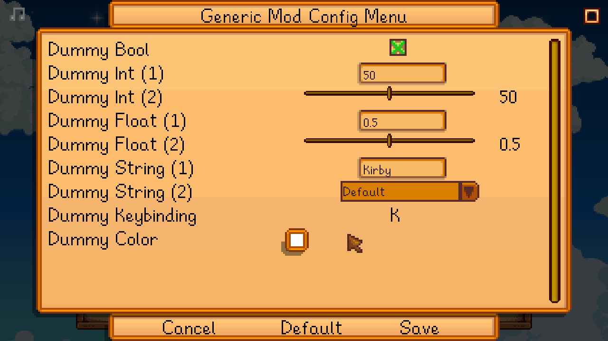

**Generic Mod Config Menu** is a [Stardew Valley](http://stardewvalley.net/) mod which adds an
in-game UI to edit other mods' config options. This only works for mods designed to support it.



## Install
1. Install the latest version of [SMAPI](https://smapi.io).
2. Install [this mod from Nexus Mods](http://www.nexusmods.com/stardewvalley/mods/5098).
3. Run the game using SMAPI.

## Use
### For players
You can edit settings from the title screen ([via the cog button](screenshot-title.png)) or in-game
([at the bottom of the in-game options menu](screenshot-in-game-options.png)). This only works for
mods which were designed to support Generic Mod Config Menu, and some mods may only allow editing
their config from the title screen.

Changes are live after saving, no need to restart the game.

### For C# mod authors
You can use [SMAPI's mod API feature](https://stardewvalleywiki.com/Modding:Modder_Guide/APIs/Integrations#Mod-provided_APIs)
to add a config UI. Your mod will always work, even if a player doesn't have Generic Mod Config Menu
installed (they just won't see the config UI).

To use it:

1. Copy [`IGenericModConfigMenuApi`](../IGenericModConfigMenuApi.cs) into your code.
2. Delete any methods in `IGenericModConfigMenuApi` you're not using (for better compatibility with
   future versions).
3. In the [`GameLaunched` event](https://stardewvalleywiki.com/Modding:Modder_Guide/APIs/Events#Game_loop),
   call the API and register your config fields.

For example, this adds a very simple config UI (assuming you [created a config
model](https://stardewvalleywiki.com/Modding:Modder_Guide/APIs/Config) named `ModConfig` and saved
it to a `Config` field in your entry class):

```c#
private void OnGameLaunched(object sender, GameLaunchedEventArgs e)
{
    // get Generic Mod Config Menu's API (if it's installed)
    var configMenu = this.Helper.ModRegistry.GetApi<IGenericModConfigMenuApi>("spacechase0.GenericModConfigMenu");
    if (configMenu is null)
        return;

    // register mod
    configMenu.Register(
        mod: this.ModManifest,
        reset: () => this.Config = new ModConfig(),
        save: () => this.Helper.WriteConfig(this.Config)
    );

    // add some config options
    configMenu.AddBoolOption(
        mod: this.ModManifest,
        name: () => "Example checkbox",
        tooltip: () => "An optional description shown as a tooltip to the player.",
        getValue: () => this.Config.ExampleCheckbox,
        setValue: value => this.Config.ExampleCheckbox = value
    );
    configMenu.AddTextOption(
        mod: this.ModManifest,
        name: () => "Example string",
        getValue: () => this.Config.ExampleString,
        setValue: value => this.Config.ExampleString = value
    );
    configMenu.AddTextOption(
        mod: this.ModManifest,
        name: () => "Example dropdown",
        getValue: () => this.Config.ExampleDropdown,
        setValue: value => this.Config.ExampleDropdown = value,
        allowedValues: new string[] { "choice A", "choice B", "choice C" }
    );
}
```

Generic Mod Config Menu will automatically choose the best field type to show each option. For
example, a string option that allows any value will be shown as a textbox; one with a set of
allowed values will be shown as a dropdown.

The text fields all use `Func<string>` so you can return translations if your mod supports them:

```c#
name: () => this.Helper.Translation.Get("translation-key")
```

See the code documentation on [`IGenericModConfigMenuApi`](../IGenericModConfigMenuApi.cs) for more
options.

### For Content Patcher pack authors
You don't need to do anything! Content Patcher will add the config UI automatically for you.

## Compatibility
Compatible with Stardew Valley 1.5.5+ on Linux/macOS/Windows, both single-player and multiplayer.

## See also
* [Release notes](release-notes.md)
