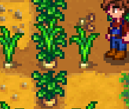

**Hybrid Crop Engine** is a [Stardew Valley](http://stardewvalley.net/) mod which lets content packs
define hybrid crops, which have a chance of appearing between two fully-grown parent crops.



## Install
1. Install the latest version of [SMAPI](https://smapi.io).
2. Install [this mod from Nexus Mods](http://www.nexusmods.com/stardewvalley/mods/6577).
3. Run the game using SMAPI.

## Use
### For players
**This mod does nothing on its own**, you need to install content packs for it.

You only need to install the mod and it'll work automatically for content packs that use it. If you
have two fully-grown crops in the ground with an empty spot between them, there's a random chance
each day a hybrid crop will start growing there.

See the optional downloads on the Nexus page for an example Garsnips mod (a hybrid of garlic and
parnsips).

### For mod authors
Edit the `Data/HybridCrops` asset using Content Patcher or [SMAPI's content API](https://stardewvalleywiki.com/Modding:Modder_Guide/APIs/Content).
For example, using Content Patcher with Json Assets tokens:

```js
{
   "Format": "1.23.0",
   "Changes": [
      {
         "Action": "EditData",
         "Target": "Data/HybridCrops",
         "Entries": {
            "{{spacechase0.JsonAssets/CropId:Garsnip}}": {
               "BaseCropA": 0,
               "BaseCropB": 4,
               "Chance": 0.05,
            }
         }
      }
   ]
}
```

The key is the crop index for the hybrid crop in the `TileSheets\crops` spritesheet. The value is
an object containing three fields:

* `BaseCropA`: the index of the first parent crop.
* `BaseCropB`: the index of the second parent crop.
* `Chance`: a percentage chance of a hybrid appearing each day, as a value between 0 and 1 (e.g.
  0.05 for 5%).

## Compatibility
Compatible with Stardew Valley 1.5.5+ on Linux/macOS/Windows, both single-player and multiplayer.

## See also
* [Release notes](release-notes.md)
