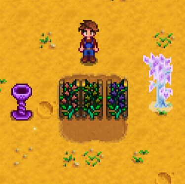

**Json Assets** is a [Stardew Valley](http://stardewvalley.net/) mod which lets content packs
add custom content to the game. It currently supports crafting recipes, crops (including giant
crops), fruit trees, big craftables, hats, weapons, clothing, and boots.

## Install
1. Install the latest versions of...
   * [SMAPI](https://smapi.io/);
   * [SpaceCore](https://www.nexusmods.com/stardewvalley/mods/1348);
   * and [Expanded Preconditions Utility](https://www.nexusmods.com/stardewvalley/mods/6529).
2. Install [this mod from Nexus Mods](http://www.nexusmods.com/stardewvalley/mods/1720).
3. Run the game using SMAPI.

## Use
### For players
This mod does nothing on its own; you need to install content packs by unzipping them into your
`Mods` folder. See _Requirements_ > _Mods requiring this file_ on the Nexus mod page to find
content packs.

Before uninstalling Json Assets, make sure you remove any custom content you added in-game.

### For mod authors
See the [author guide](author-guide.md) for more info.

## Compatibility
Compatible with Stardew Valley 1.5.5+ on Linux/macOS/Windows, both single-player and multiplayer.

## See also
* [Release notes](release-notes.md)
