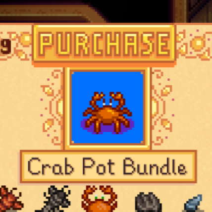

**Junimos Accept Cash** is a [Stardew Valley](http://stardewvalley.net/) mod which lets you
purchase community center bundles with gold.

## Install
1. Install the latest version of [SMAPI](https://smapi.io).
2. Install [this mod from Nexus Mods](http://www.nexusmods.com/stardewvalley/mods/7437).
3. Run the game using SMAPI.

## Use
Click the purchase button above the bundle icon in the community center UI to complete the bundle.
The price changes based on the most expensive items left in the bundle.

## Compatibility
Compatible with Stardew Valley 1.5.5+ on Linux/macOS/Windows, both single-player and multiplayer.

## See also
* [Release notes](release-notes.md)
