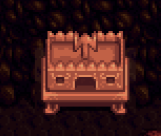
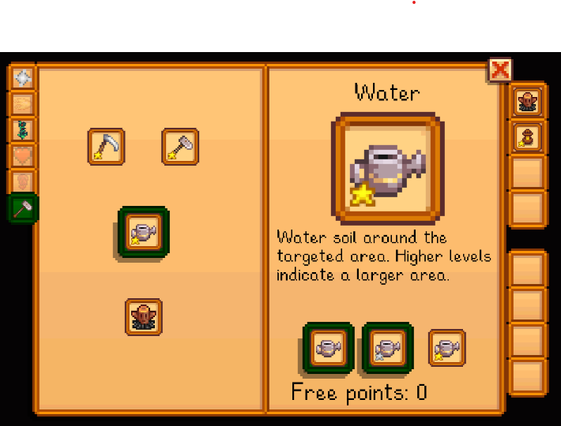

# Magic
This is the source code. Releases can be found at:
* [My site](http://spacechase0.com/mods/stardew-valley/magic)
* [Nexus]()
* [Chucklefish forums](https://community.playstarbound.com/resources/magic.5242/)

Magic!

This is an early release. It may be unbalanced and/or buggy.

To unlock magic, visit the wizard with three hearts or more. Then visit the altar in Pierre's shop
and equip some spells. Drag the spells to your hotbar. Press Q and a number key (1-4) to cast a
spell, and tab to swap between spell sets.

To get the mana potion recipe, visit the adventurer's guild.

Hints on using the Analyze spell to unlock more spells appear on the TV.

  

## See also
* [Release notes](release-notes.md)
* [Spell icons from OpenGameArt](https://opengameart.org/content/painterly-spell-icons-part-1)
