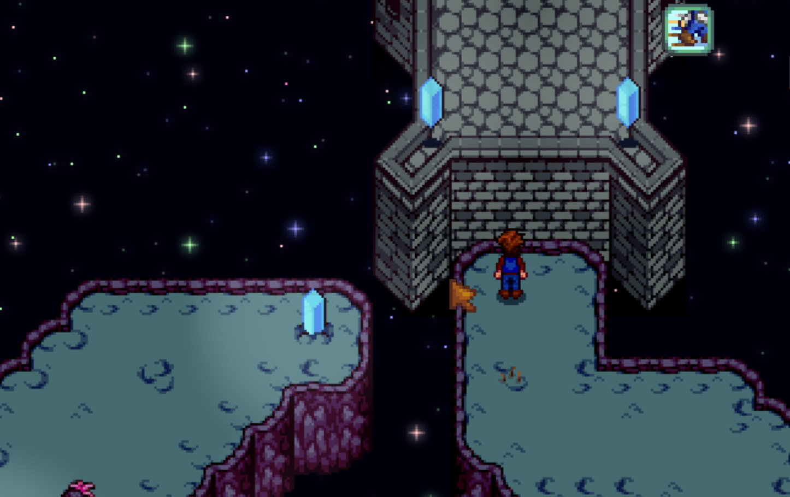

**Moon Misadventures** is a [Stardew Valley](http://stardewvalley.net/) mod which lets you visit
the moon!

## Install
1. Install the latest version of...
   * [SMAPI](https://smapi.io);
   * [Dynamic Game Assets](https://www.nexusmods.com/stardewvalley/mods/9365);
   * [Extra Map Layers](https://www.nexusmods.com/stardewvalley/mods/9633);
   * and [SpaceCore](https://www.nexusmods.com/stardewvalley/mods/1348).
2. Install [this mod from Nexus Mods](http://www.nexusmods.com/stardewvalley/mods/10612).
3. Run the game using SMAPI.

## Use
Visit the dwarf and repair an ancient vehicle of his with late-game materials, and visit the moon
for a new challenge.

This mod includes:
* Two new tool tiers, radioactive and mythicite.
* A new procedural 'dungeon' located on the moon, with new ore, new enemies, and new treasure.
 * New ore: Mythicite
 * New enemies: Currently slimes, and a mob that shoots explosions.
 * New treasures: New structures that can contain necklaces, anti-gravity gauntlets (moves moon animals around),  new boots, and materials for the Celestial Infuser.
* A new area to farm in, with certain things (animals and crops) that only function on the moon. (These must be found in the dungeon.)
* A new accessory type and slot for it, obtainable only on the moon.
* The Celestial Infuser, a new 'forge', usable for a new tier of weapons, getting a second enchantment on tools, and making an item guaranteed not lost on death.

## Compatibility
Compatible with Stardew Valley 1.5.5+ on Linux/macOS/Windows, both single-player and multiplayer.

## See also
* [Release notes](release-notes.md)
