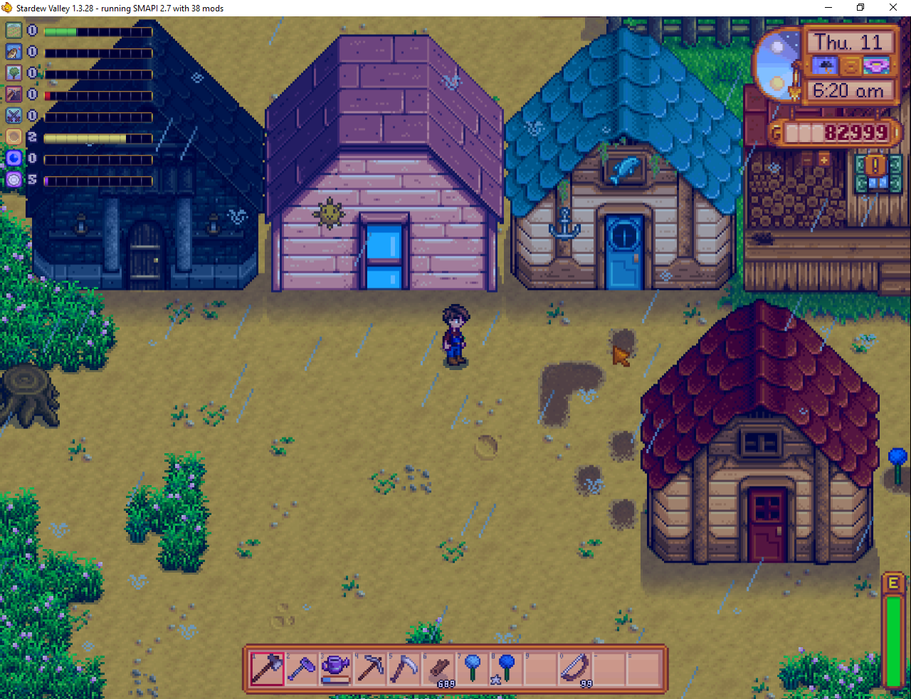

**More Buildings** is a [Stardew Valley](http://stardewvalley.net/) mod which adds some new
buildings with special effects.

## Install
1. Install the latest version of...
   * [SMAPI](https://smapi.io);
   * and [SpaceCore](https://www.nexusmods.com/stardewvalley/mods/1348).
2. Install [this mod from Nexus Mods](http://www.nexusmods.com/stardewvalley/mods/2757).
3. Run the game using SMAPI.

## Use
You can buy the new buildings from Robin's construction menu. The available buildings are...

building      | effects
------------- | -------
Spooky Shed   | Place a mob drop in the crystal, and mobs will spawn when you enter the building. This currently works with Bat Wing (spawns bats), Solar Essence (spawns squid kids), Void Essence (spawns shadow brutes), and Bug Meat (spawns flies).
Mini Spa      | A place to relax and gain stamina.
Fishing Shack | Lets you catch any fish again, including legendaries.
~~Big Shed~~  | ~~An upgrade for the normal shed.~~ (Deprecated since there's a vanilla big shed upgrade now.)

## Compatibility
Compatible with Stardew Valley 1.5+ on Linux/macOS/Windows, both single-player and multiplayer.

## See also
* [Release notes](release-notes.md)
