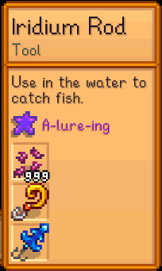

**More Enchantments** is a [Stardew Valley](http://stardewvalley.net/) mod which adds some new
tool enchantments.

## Install
This mod isn't released yet.

1. ~~Install the latest version of...~~
   * ~~[SMAPI](https://smapi.io);~~
   * ~~and [SpaceCore](https://www.nexusmods.com/stardewvalley/mods/1348).~~
2. ~~Install this mod from Nexus Mods.~~
3. ~~Run the game using SMAPI.~~

## Use
You can apply the enchantments at the [Forge](https://stardewvalleywiki.com/Forge) using a
prismatic shard, like the normal random enchantments.

This mod adds these enchantments:

tool        | name       | effect
----------- | ---------- | ------
fishing rod | A-lure-ing | You can equip two lures.

## Compatibility
Compatible with Stardew Valley 1.5+ on Linux/macOS/Windows, both single-player and multiplayer.

## See also
* [Release notes](release-notes.md)
