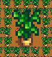

**More Giant Crops** is a [Stardew Valley](http://stardewvalley.net/) mod which lets you add new
giant crops.



## Install
1. Install the latest version of [SMAPI](https://smapi.io).
2. Install [this mod from Nexus Mods](http://www.nexusmods.com/stardewvalley/mods/5263).
3. Run the game using SMAPI.

## Use
### Adding giant crops
This mod doesn't include any crops by default; you need to download the textures you want to use.
You can find available downloads by expanding the _Requirements_ section on the mod page, and
checking the _Mods requiring this file_ list.

More Giant Crops will create an `assets` folder the first time you run it. You can add any number
of giant crops as `.png` images to this folder. For example, this adds garlic and parsnips as giant
crops:

```
📁 Mods/
   📁 MoreGiantCrops/
      📁 assets/
         🗎 24.png
         🗎 248.png
```

### For mod authors
The name of each file must be the crop's produce ID (i.e. the key in
[`Data\ObjectInformation`](https://stardewvalleywiki.com/Modding:Object_data), or the _index of
harvest_ field in [`Data\Crops`](https://stardewvalleywiki.com/Modding:Crop_data)). The images must
be exactly 48 pixels wide by 64 pixels high.

## Compatibility
Compatible with Stardew Valley 1.5.5+ on Linux/macOS/Windows, both single-player and multiplayer.

## See also
* [Release notes](release-notes.md)
