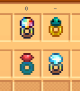

**More Rings** is a [Stardew Valley](http://stardewvalley.net/) mod which adds new rings with
special effects.

## Install
1. Install the latest version of...
   * [SMAPI](https://smapi.io);
   * [Json Assets](https://www.nexusmods.com/stardewvalley/mods/1720);
   * and [SpaceCore](https://www.nexusmods.com/stardewvalley/mods/1348).
2. Install [this mod from Nexus Mods](http://www.nexusmods.com/stardewvalley/mods/2054).
3. Run the game using SMAPI.

## Use
This mod adds seven new rings:

ring                  | effect when equipped                  | effect when stacked¹    | purchase recipe from
:-------------------- | :------------------------------------ | :---------------------- | :-------------------
Quality+ Ring         | 12.5% chance of raising crop quality by one. | +12.5% per ring. | Dwarf
Refreshing Ring       | Restore stamina passively.            | higher regen rate.      | Krobus
Ring of Diamond Booze | Negate the tipsy effect from alcohol. | _none._                 | Dwarf
Ring of Far Reaching  | Use tools at a distance.              | _none._                 | Dwarf
Ring of Regeneration  | Regenerate health passively.          | higher regen rate.      | Marlon
Ring of True Sight    | See what's in mining nodes and artifact spots. | _none._        | Dwarf
Ring of Wide Nets     | 50% larger fishing bar.               | _none._                 | Willy when it's raining

_¹ "Stacking" means having more than one of the same ring equipped._

## Compatibility
Compatible with Stardew Valley 1.5.5+ on Linux/macOS/Windows, both single-player and multiplayer.

## See also
* [Release notes](release-notes.md)
* Credit to Paradigm for some of the ring sprites.
