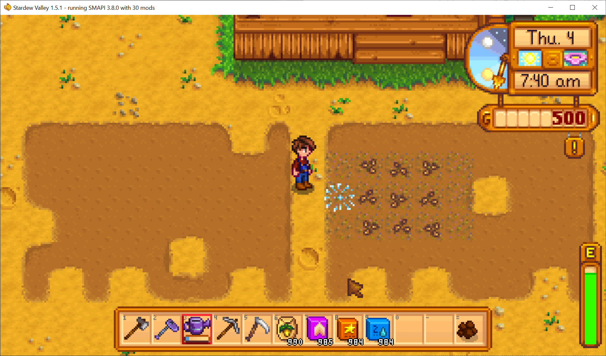

**MultiFertilizer** is a [Stardew Valley](http://stardewvalley.net/) mod which lets you apply
multiple types of fertilizer to a crop space!

## Install
1. Install the latest version of [SMAPI](https://smapi.io).
2. Install [this mod from Nexus Mods](http://www.nexusmods.com/stardewvalley/mods/7436).
3. Run the game using SMAPI.

## Use
Just apply fertilizer to crop spaces like usual. Now you'll be able to apply a different type even
if they're already fertilized.

## Compatibility
Compatible with Stardew Valley 1.5.5+ on Linux/macOS/Windows, both single-player and multiplayer.

## For mod authors
You can detect multi-fertilizer on a dirt tile by checking for these fields in the `HoeDirt.modData`
field:

`modData` key                                  | effect
---------------------------------------------- | ------
`spacechase0.MultiFertilizer/FertilizerLevel`  | The fertilizer level: `1` ([Basic](https://stardewvalleywiki.com/Basic_Fertilizer)), `2` ([Quality](https://stardewvalleywiki.com/Quality_Fertilizer)), or `3` ([Deluxe](https://stardewvalleywiki.com/Deluxe_Fertilizer)).
`spacechase0.MultiFertilizer/WaterRetainLevel` | The water retaining soil: `1` ([Basic](https://stardewvalleywiki.com/Basic_Retaining_Soil)), `2` ([Quality](https://stardewvalleywiki.com/Quality_Retaining_Soil)), or `3` ([Deluxe](https://stardewvalleywiki.com/Deluxe_Retaining_Soil)).
`spacechase0.MultiFertilizer/SpeedGrowLevel`   | The speed gro level: `1` ([Speed-Gro](https://stardewvalleywiki.com/Speed-Gro)), `2` ([Deluxe](https://stardewvalleywiki.com/Deluxe_Speed-Gro)), or `3` ([Hyper](https://stardewvalleywiki.com/Hyper_Speed-Gro)).

If a key isn't set, the crop doesn't have any fertilizer of that type applied.

## See also
* [Release notes](release-notes.md)
