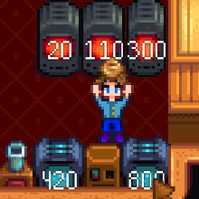

**Object Time Left** is a [Stardew Valley](http://stardewvalley.net/) mod which lets you see how
much time is left until machines finish processing.

## Install
1. Install the latest version of [SMAPI](https://smapi.io).
2. Install [this mod from Nexus Mods](http://www.nexusmods.com/stardewvalley/mods/1315).
3. Run the game using SMAPI.

## Use
Press `L` (configurable) to toggle the overlay.

## Compatibility
Compatible with Stardew Valley 1.5.5+ on Linux/macOS/Windows, both single-player and multiplayer.

## See also
* [Release notes](release-notes.md)
