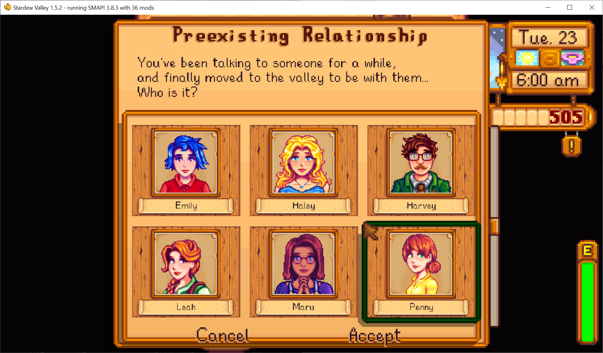

**Preexisting Relationship** is a [Stardew Valley](http://stardewvalley.net/) mod which lets you
start the game already married to an NPC.

## Install
1. Install the latest version of...
   * [SMAPI](https://smapi.io);
   * and [SpaceCore](https://www.nexusmods.com/stardewvalley/mods/1348).
2. Install [this mod from Nexus Mods](http://www.nexusmods.com/stardewvalley/mods/7684).
3. Run the game using SMAPI.

## Use
Start a new save (or load an unmarried save), and when the day starts you'll see a menu asking who
you're married to. You'll start with the first house upgrade (so they have their spouse room), and
heart events will still trigger like usual.

## Compatibility
Compatible with Stardew Valley 1.5.5+ on Linux/macOS/Windows, both single-player and multiplayer.

## See also
* [Release notes](release-notes.md)
