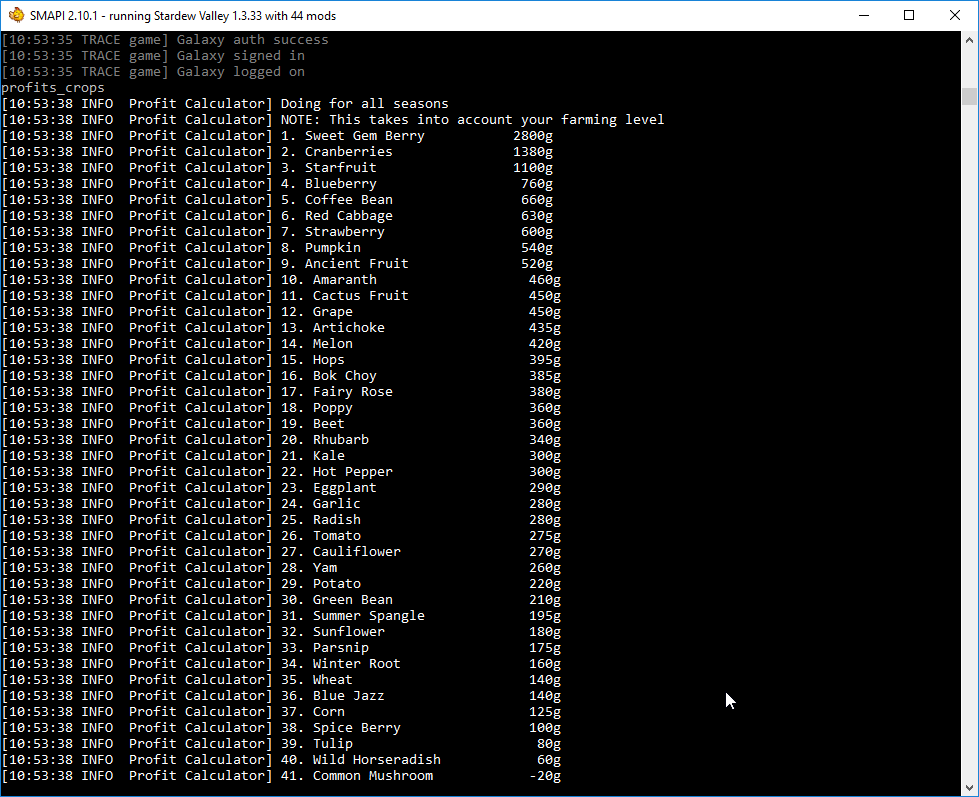

**Profit Calculator** is a [Stardew Valley](http://stardewvalley.net/) mod which adds a console
command to calculate the profits from growing each crop for an entire season.

## Install
1. Install the latest version of [SMAPI](https://smapi.io).
2. Install [this mod from Nexus Mods](http://www.nexusmods.com/stardewvalley/mods/3378).
3. Run the game using SMAPI.

## Use
Load your save, then run `profits_crops` in the console to calculate crop profits. This includes
any custom crops you installed, and will take account of your farming level.

You can optionally check for a particular season like `profits_crops spring`.

## Compatibility
Compatible with Stardew Valley 1.6.0+ on Linux/macOS/Windows, both single-player and multiplayer.

## See also
* [Release notes](release-notes.md)
