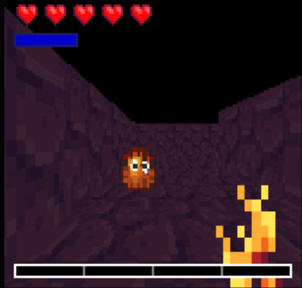

**Pyromancer's Journey** is a [Stardew Valley](http://stardewvalley.net/) mod which adds a new
Doom-style arcade game.

## Install
1. Install the latest version of...
   * [SMAPI](https://smapi.io);
   * and [SpaceCore](https://www.nexusmods.com/stardewvalley/mods/1348).
2. Install [this mod from Nexus Mods](https://www.nexusmods.com/stardewvalley/mods/7455).
3. Run the game using SMAPI.

## Use
You can start the journey by interacting with the arcade machine in the [Volcano
Dungeon](https://stardewvalleywiki.com/Volcano_Dungeon) shop:

Press `W`/`S`/`Q`/`E` to move, `A`/`D` to turn, `space` to charge your staff and release to shoot.
Beat the game to win a prize!

You can also start the game by running the `pyrojourney` command in the SMAPI console.

## Compatibility
Compatible with Stardew Valley 1.5.5+ on Linux/macOS/Windows, both single-player and multiplayer.

## See also
* [Release notes](release-notes.md)
