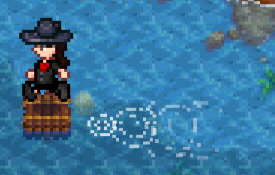
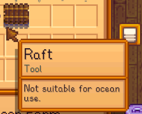

**Raft Restoration** is a [Stardew Valley](http://stardewvalley.net/) mod which reimplements the
game's unimplemented raft feature.

  

## Install
This mod isn't released yet.

1. ~~Install the latest version of [SMAPI](https://smapi.io).~~
2. ~~Install this mod from Nexus Mods.~~
3. ~~Run the game using SMAPI.~~

## Use
You can buy the raft from Pierre's shop for 5000g. Select it in your inventory and left-click any
water to start rafting; just raft onto land to dismount. Dismounting will put it back in your
inventory automatically.

## Compatibility
Compatible with Stardew Valley 1.5+ on Linux/macOS/Windows, both single-player and multiplayer.

## See also
* [Release notes](release-notes.md)
