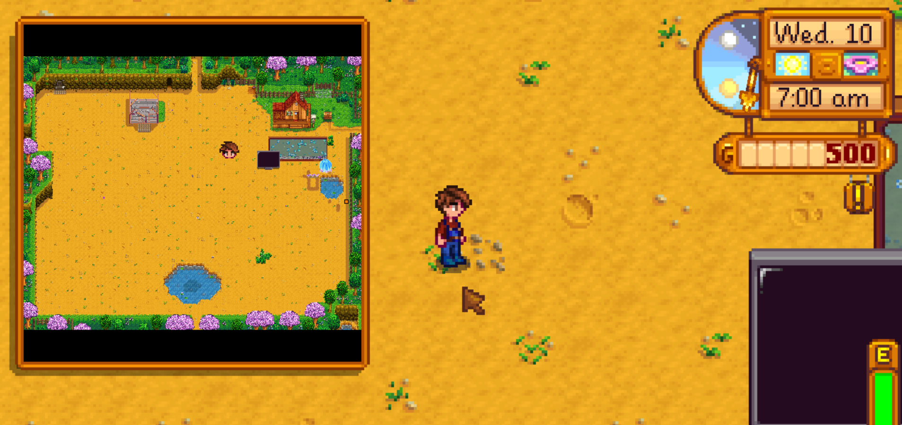

**Realtime Minimap** is a [Stardew Valley](http://stardewvalley.net/) mod which adds a minimap to
the top-left corner which renders a live view of your current location.

## Install
1. Install the latest version of [SMAPI](https://smapi.io).
2. Install [this mod from Nexus Mods](http://www.nexusmods.com/stardewvalley/mods/9386).
3. Run the game using SMAPI.

## Use
The minimap appears in the top-left corner by default. It shows the current location with markers
for players, NPCs, and signs (or the items placed on them). You can press `CTRL` + `M` to toggle it.

You can edit the mod settings via Generic Mod Config Menu (or by editing the `config.json` file
directly) to change the toggle keybind, minimap position and size, and marker sizes.

## Compatibility
Compatible with Stardew Valley 1.5.5+ on Linux/macOS/Windows, both single-player and multiplayer.

## Known issues
* The minimap view is cached when you enter the location by default. You can enable full real-time
  updates in the mod settings (by changing `UpdateInterval` to a number above 0), but this may
  impact game performance.
* Markers might be a bit off-center on small maps. This is mainly meant for large maps.

## See also
* [Release notes](release-notes.md)
