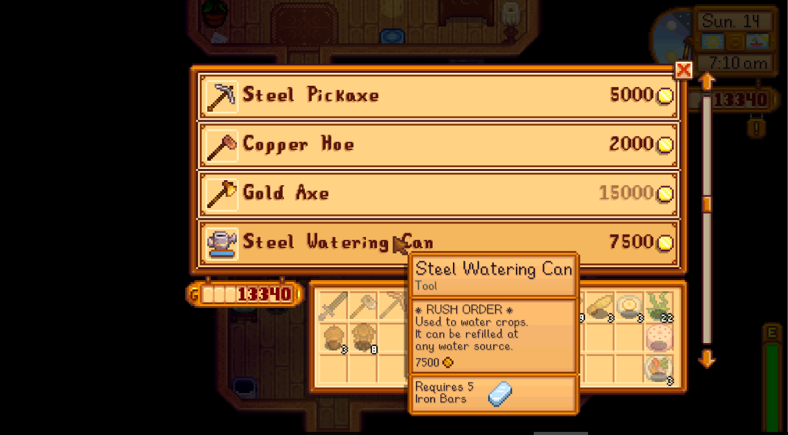

**Rush Orders** is a [Stardew Valley](http://stardewvalley.net/) mod which lets you spend more gold
to have Clint upgrade tools faster or Robin construct buildings faster.

## Install
1. Install the latest version of [SMAPI](https://smapi.io).
2. Install [this mod from Nexus Mods](http://www.nexusmods.com/stardewvalley/mods/605).
3. Run the game using SMAPI.

## Use
The mod affects two shops:

* In Clint's shop, you can choose from three tool upgrade option: normal (three days), one
  day (1.5× cost), and immediate (2× cost).
* In Robin's shop, you can start a building construction or farmhouse upgrade normally. After
  placing the building, you'll be given the option to speed up construction for an extra 50% of the
  base price per day.

The prices can be configured by editing the `config.json` file.

## Compatibility
Compatible with Stardew Valley 1.5.5+ on Linux/macOS/Windows, both single-player and multiplayer.

## See also
* [Release notes](release-notes.md)
