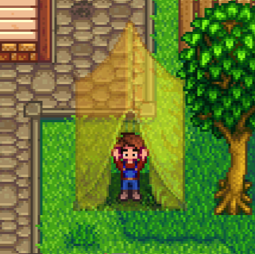

**Sleepy Eye** is a [Stardew Valley](http://stardewvalley.net/) mod which lets you buy a reusable
tent to sleep anywhere!

## Install
1. Install the latest version of...
   * [SMAPI](https://smapi.io);
   * and [SpaceCore](https://www.nexusmods.com/stardewvalley/mods/1348).
2. Install [this mod from Nexus Mods](http://www.nexusmods.com/stardewvalley/mods/1152).
3. Run the game using SMAPI.

## Use
Sleep here. Sleep there. Sleep everywhere!

You can buy the tent from Pierre's shop for 5000g. Select it in your toolbar and **hold** left-click
for seven seconds (configurable) to go to sleep.

## Compatibility
Compatible with Stardew Valley 1.5.5+ on Linux/macOS/Windows, both single-player and multiplayer.

## See also
* [Release notes](release-notes.md)
