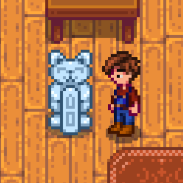

**Statue of Generosity** is a [Stardew Valley](http://stardewvalley.net/) mod that adds a statue
which produces loved gifts each morning.

## Install
1. Install the latest version of...
   * [SMAPI](https://smapi.io);
   * and [Json Assets](https://www.nexusmods.com/stardewvalley/mods/1720).
2. Install [this mod from Nexus Mods](http://www.nexusmods.com/stardewvalley/mods/7532).
3. Run the game using SMAPI.

## Use
You can buy Statues of Generosity from Krobus for 100,000g. Each day it will produce a loved gift
for the villager whose birthday it is today, or for a random villager if there's no birthday.

## Compatibility
Compatible with Stardew Valley 1.5.5+ on Linux/macOS/Windows, both single-player and multiplayer.

## See also
* [Release notes](release-notes.md)
