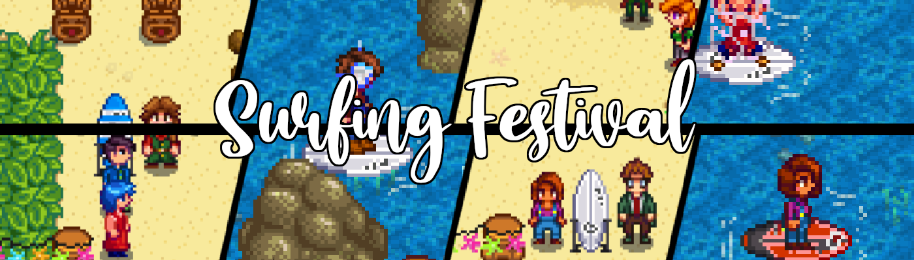



**Surfing Festival** is a [Stardew Valley](http://stardewvalley.net/) mod which adds a new summer
festival where you can race some of your friends in the town!

## Install
1. Install the latest version of...
   * [SMAPI](https://smapi.io);
   * [Json Assets](https://www.nexusmods.com/stardewvalley/mods/1720);
   * [Content Patcher](https://www.nexusmods.com/stardewvalley/mods/1915);
   * [Content Patcher Animations](https://www.nexusmods.com/stardewvalley/mods/3853);
   * [Mail Framework Mod](https://www.nexusmods.com/stardewvalley/mods/1536);
   * and [Shop Tile Framework](https://www.nexusmods.com/stardewvalley/mods/5005).
2. Install [this mod from Nexus Mods](http://www.nexusmods.com/stardewvalley/mods/6688).
3. Run the game using SMAPI.

Before uninstalling, make sure to delete every existing item added by this mod.

## Use
Visit the beach on summer 5 to start [the festival](screenshot-festival.png). When you're ready,
talk to Lewis to start the [surf race](screenshot-surfing.png).

Don't put anything weird in the bonfire.

**Known issues:**
* Before the race, the text explaining the powerups extends past the textbox. It still works as
  intended, it's just a bit harder to read the bottom word.
* When using the Stardrop powerup, your character may jump forward and backwards. That's a bug due
  to how fast you're going.

## Compatibility
Compatible with Stardew Valley 1.5.5+ on Linux/macOS/Windows, both single-player and multiplayer.

## See also
* [Release notes](release-notes.md)
* Made for the [Stardew Valley Discord](https://stardewvalleywiki.com/Modding:Community)'s 2020
  summer event (for the 'wavy' theme).
