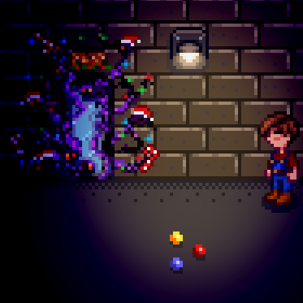

**Theft of the Winter Star** is a [Stardew Valley](http://stardewvalley.net/) mod which adds a new
dungeon area before the Feast of the Winter Star festival, and a new late-game farming equipment if
you beat it.

## Install
1. Install the latest version of...
   * [SMAPI](https://smapi.io);
   * [Json Assets](https://www.nexusmods.com/stardewvalley/mods/1720);
   * and [SpaceCore](https://www.nexusmods.com/stardewvalley/mods/1348).
2. Install [this mod from Nexus Mods](http://www.nexusmods.com/stardewvalley/mods/5062).
3. Run the game using SMAPI.

## Use
### Overview
Someone stole the decorations for the Feast of the Winter Star! When you leave the farmhouse in
winter (anytime before winter 25), Lewis will tell you about it and start you on the path for the
quest.

Beating the quest line will give you a stardrop, a friendship bonus with the entire town, and the
Tempus Globe recipe.

### Tempus Globe
Beating the dungeon gives you the recipe for the Tempus Globe, a mystical item which can be crafted
and placed on your farm. Crops in a 5x5 area around Tempus Globes will grow year-long and be
auto-watered.

Crafting a Tempus Globe requires an iridum sprinkler, 25 Solar Essence, and 25 Void Essence.

### Solution
**Spoilers ahead!**

1. Exit the farmhouse in winter (before winter 25), and a cutscene with Lewis will play.
2. Walk into the tunnel at the bus stop.
3. Interact with the strange hole at the end of the tunnel to enter the new dungeon.
4. Right-click the bag in the second room to get the first key. (Do it again for the first frosty
   stardrop piece.) Use the key on the first door in the previous room to proceed.
5. In the room with three pedestals, place (in order) a Frozen Tear, Solar Essence, and Void
   Essence. You'll receive another frosty stardrop piece, a key, and a Festive Scepter. You can
   also bomb the wall here for another frosty stardrop piece.
6. In the room with the boss door, head left and solve the maze for the boss key (half A). The door
   in the top-left leads to a target you need to hit with a projectile for a frosty stardrop piece.
7. In the room with the push block puzzle, you need to push a white block onto the blue tile for
   the boss key (half B). You can also bomb the wall here for another frosty stardrop piece.
8. At this point you can craft the frosty stardrop pieces together for a Frosty Stardrop.
9. Put the boss key halves onto the pedestals to open the door and fight the boss.
10. Beat the boss to get half a heart with the entire town, and a recipe for the Tempus Globe.

## Compatibility
Compatible with Stardew Valley 1.5.5+ on Linux/macOS/Windows, both single-player and multiplayer.

## See also
* [Release notes](release-notes.md)
