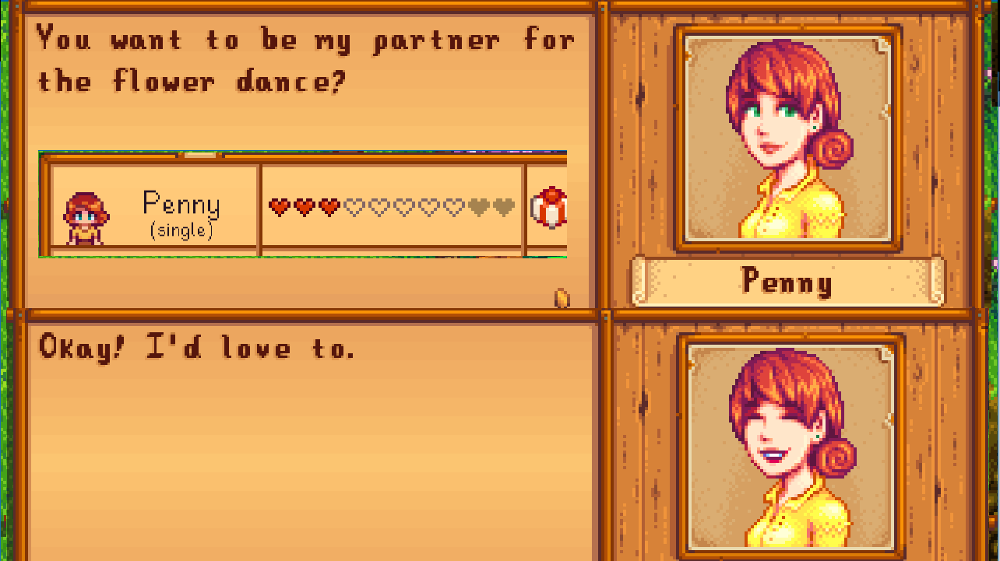
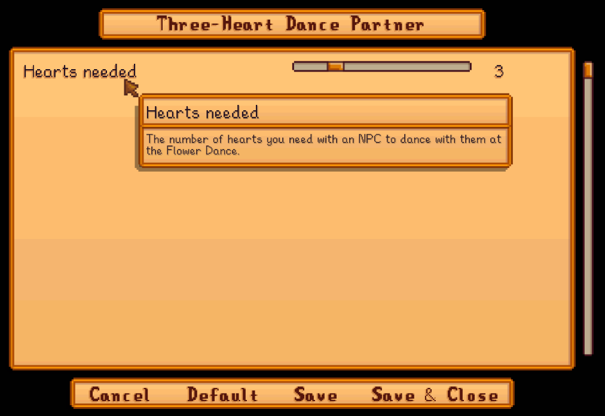

**Three-Heart Dance Partner** is a [Stardew Valley](http://stardewvalley.net/) mod which lets you
dance with a villager at the Flower Dance with three hearts instead of four, so it's achievable
in the first year.

## Install
1. Install the latest version of [SMAPI](https://smapi.io).
2. Install [this mod from Nexus Mods](http://www.nexusmods.com/stardewvalley/mods/500).
3. Run the game using SMAPI.

## Use
The mod works automatically once installed. If you have at least three hearts with an NPC, they'll
accept at the Flower Festival if you ask them to dance.

### Formula
The Flower Dance happens on spring 24, which gives you 23 days to get three hearts (750 points)
with the NPC of your choice.

To achieve that in year one, you can talk to them every day (+20 points/day) and give them two
liked gifts per week (+45 points/gift). That gives you `(23 days × 20 points) + (4 weeks × 2 gifts
× 45 points)` or 820 points. You can use [Lookup Anything](https://www.nexusmods.com/stardewvalley/mods/541)
to see your exact friendship points with an NPC.

## Configure
### In-game settings
If you have [Generic Mod Config Menu](https://www.nexusmods.com/stardewvalley/mods/5098) installed,
you can click the cog button (⚙) on the title screen to configure the mod. Hover the cursor over a
field for details, or see the next section.

Note that the colors aren't editable through this UI.

### `config.json` file
The mod creates a `config.json` file in its mod folder the first time you run it. You can open that
file in a text editor to configure the mod. If you make a mistake, you can delete the `config.json`
and it'll recreate a default one.

Here's what you can change:

field | description
----- | -----------
`RequiredHearts` | The number of hearts you need with an NPC to dance with them at the Flower Dance.

## Compatibility
Compatible with Stardew Valley 1.5.5+ on Linux/macOS/Windows, both single-player and multiplayer.

## See also
* [Release notes](release-notes.md)
